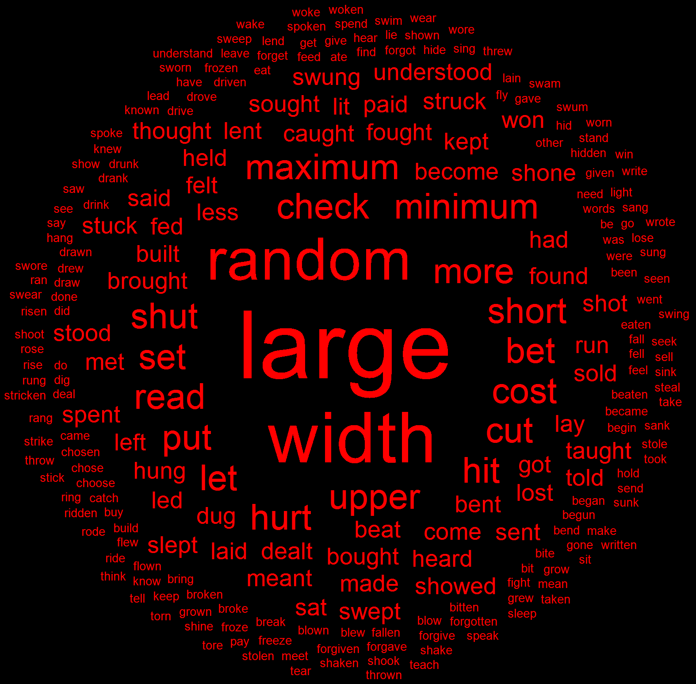
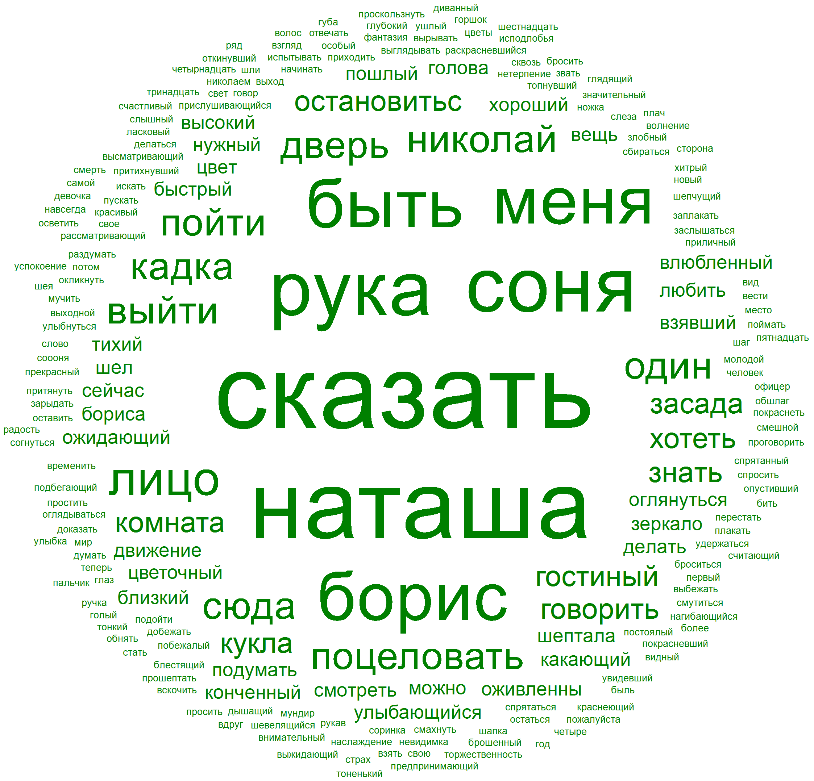
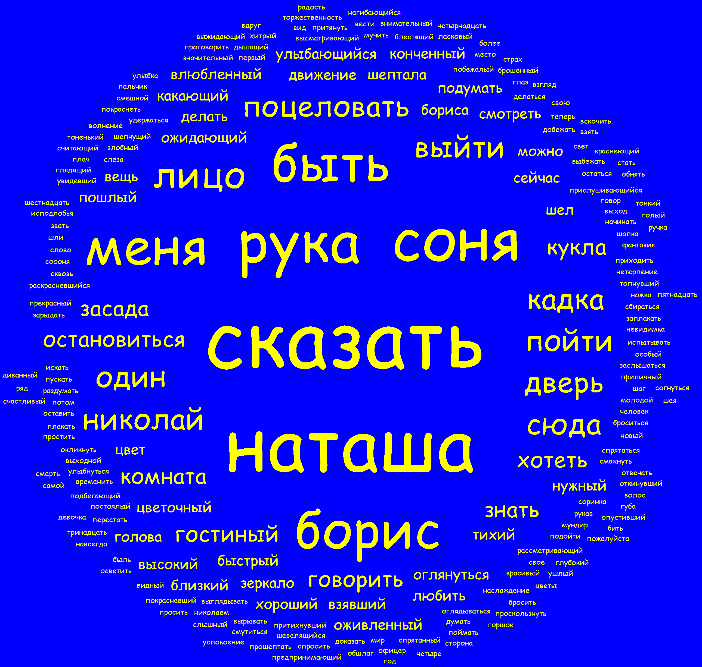
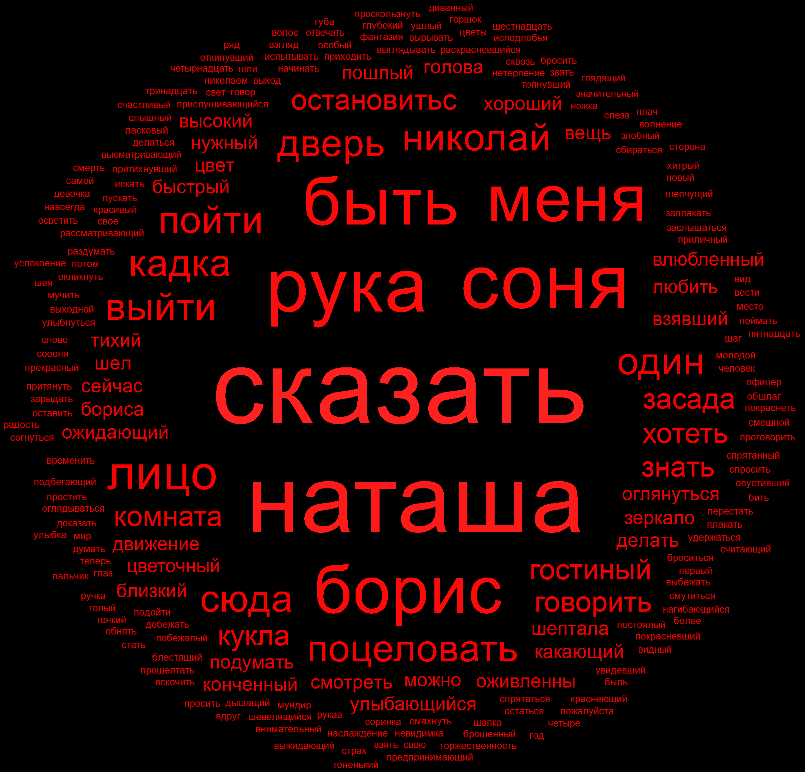

# TagCloud

Program to generate Tag Cloud from set of words  
Made for "School of Industrial Programming" course in FP style  
Git history and foulders look funny because it's import of existing project

There are words editing functions:
 - bringing to the initial form
 - filtration of "spam words"  
But most of them work only with russian words

## Examples

---

